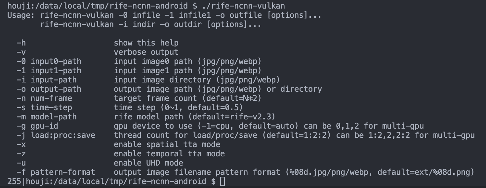

# RIFE ncnn Android

Android platform support for [rife-ncnn-vulkan](https://github.com/nihui/rife-ncnn-vulkan/) by nihui.

# Compile

1. Clone this repo, and update submodules

```bash
git clone git@github.com:hermit1x/rife-ncnn-android.git
cd rife-ncnn-android
git submodule update --init --recursive
```

2. Download Android SDK and NDK (Recommend download with Android Studio)

3. Modify```compile.sh```:
```bash
# replace
export sdk_cmake="/Users/hh/Library/Android/sdk/cmake/3.22.1/bin/cmake"
# with
export sdk_cmake="${Your_path_to_AndroidSDK}/cmake/${Your_cmake_version}/bin/cmake"
```

4. Modify```CMakeLists.txt```:
```bash
# replace
set(NDK "/Users/hh/Library/Android/sdk/ndk/27.0.12077973")
# with
set(NDK "${Your_path_to_Android_NDK}")
```
And change ```ANDROID_ABI```, ```ANDROID_PLATFORM``` if needed.

> note: ANDROID_PLATFORM must >= 24 to support Vulkan

5. Compile! 
```bash
./compile.sh
```
The output executable file is ```build/bin/rife-ncnn-vulkan```

# Run on Android

Use adb shell to run this program on Android mobile devices.

1. Install ```adb```
2. Copy program and models to mobile:
```bash
adb push build/bin/rife-ncnn-vulkan /data/local/tmp/rife-ncnn-android/
adb push rife-ncnn-vulkan/models/rife-v2.3 /data/local/tmp/rife-ncnn-android/
```
3. Active adb shell
```bash
adb shell
```
4. Run the program
```bash
# in adb shell
cd /data/local/tmp/rife-ncnn-android
./rife-ncnn-vulkan
```

